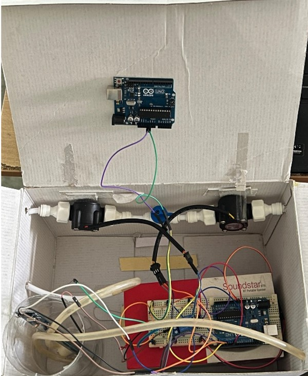

# 💧 Water Quality Monitoring and Management System

This project is an Arduino-based multi-stage water quality monitoring and management system. It uses sensors to ensure the water is suitable for use, detects any leakage in the distribution, and calculates the volume consumed by the user. If the usage exceeds a defined threshold, it calculates the billing cost.

---

## 📌 Key Features

- ✅ **Water Quality Check** using pH and TDS sensors
- 💡 **Automated Pump Control** — Only activates when water is of good quality
- 🔍 **Leakage Detection** — Compares flow rate from two sensors to detect discrepancies
- 📊 **Water Usage Monitoring** — Measures volume consumed
- 💰 **Billing Calculation** — Displays cost if usage exceeds the defined limit

---

## 📸 Project Overview

---

## ⚙️ System Architecture

The system consists of **three modules**:

### 🔹 Module 1: Water Quality Control
- **Components**: pH Sensor, TDS Sensor, Relay Module, Water Pump, Arduino UNO
- **Function**: Checks water quality. If acceptable, it powers the pump via a relay.

### 🔹 Module 2: Leakage Detection
- **Components**: Two Water Flow Sensors (Inlet and Mid-point), Arduino UNO
- **Function**: Detects leakage by comparing flow rate difference between sensors.

### 🔹 Module 3: Consumption and Billing
- **Components**: Final Flow Sensor (Output), Arduino UNO
- **Function**: Calculates total water volume consumed. If above threshold, computes billing.

---

## 🔩 Hardware Components

| Component          | Quantity | Description                     |
|-------------------|----------|---------------------------------|
| Arduino UNO       | 1        | Main microcontroller            |
| Relay Module       | 1        | Controls water pump             |
| pH Sensor          | 1        | Measures water pH               |
| TDS Sensor         | 1        | Measures Total Dissolved Solids |
| Water Flow Sensor  | 3        | Measures flow and leakage       |
| Water Pump         | 1        | Pumps water when quality is good|
| Pipes & Tank       | As needed | For water flow setup           |
| Jumper Wires       | As needed | Circuit connections            |

---

## 🔌 Circuit Setup Overview

- **Relay Control Pin** → Arduino Pin `6`
- **Flow Sensor 1 (Inlet)** → Digital Pin `2`
- **Flow Sensor 2 (Midpoint)** → Digital Pin `3`
- **pH/TDS Sensor** → Serial Input via `Serial.readStringUntil()`

> Note: Adjust serial input code depending on your pH and TDS sensor communication logic.

---

